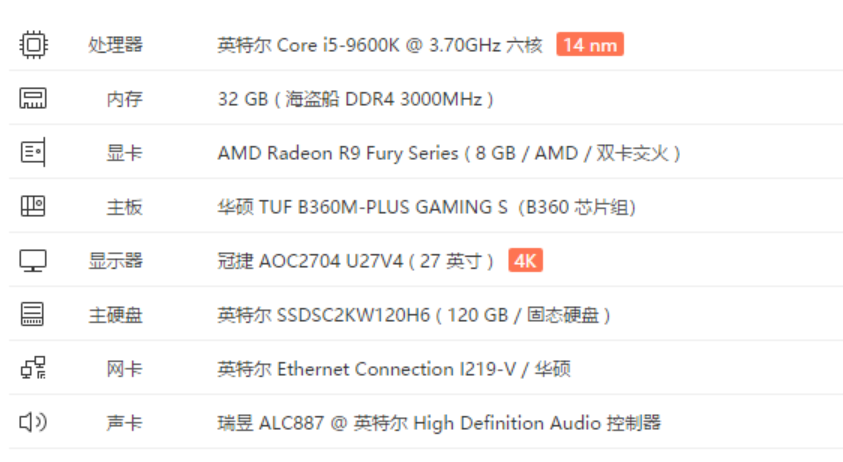
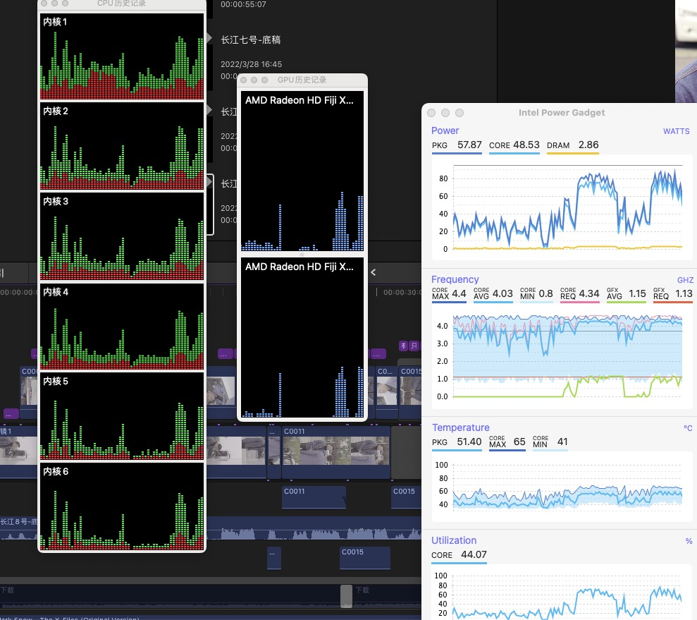
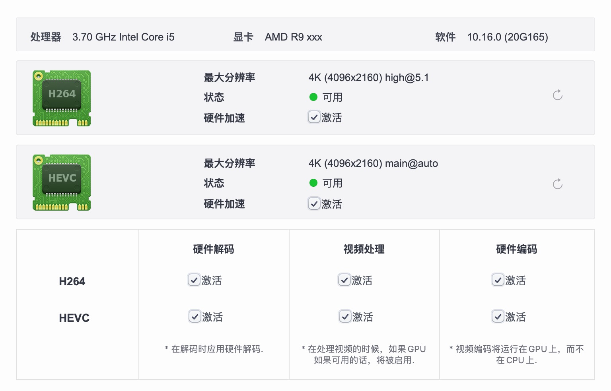

# ASUS-TUF-B360M-PLUS-GAMING-S
华硕 Asus TUF B360M-PLUS GAMING S i5-9600K AMD R9 Fury 基于 OpenCore 0.7.9 的 Hackintosh 的 EFI 配置文件

# 配置概览

主要的配置如下：

# 驱动情况

驱动完美度挺高的，基于 OC 0.7.9，用来做视频剪辑当做生产力也是完全没问题的：

# 项目贡献值

本项目由群友 Z 贡献的，他的 QQ 如下，欢迎与他 PY 交流：

